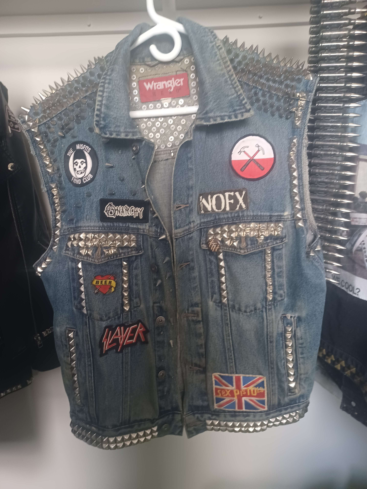
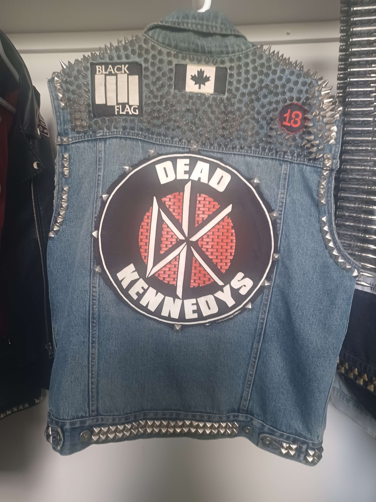
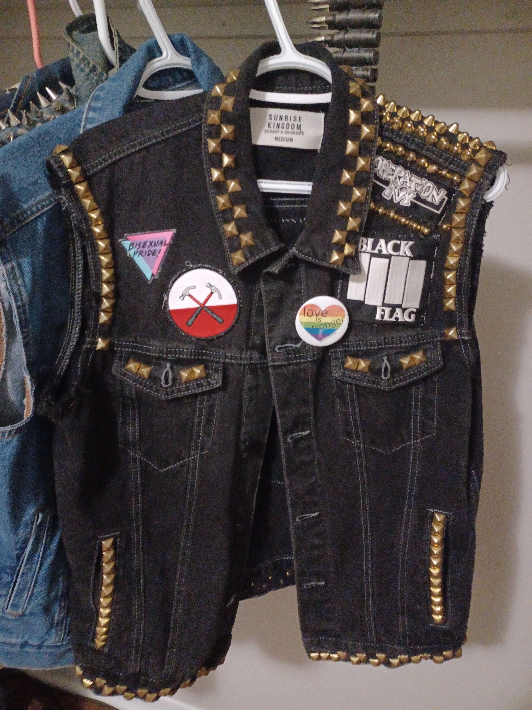
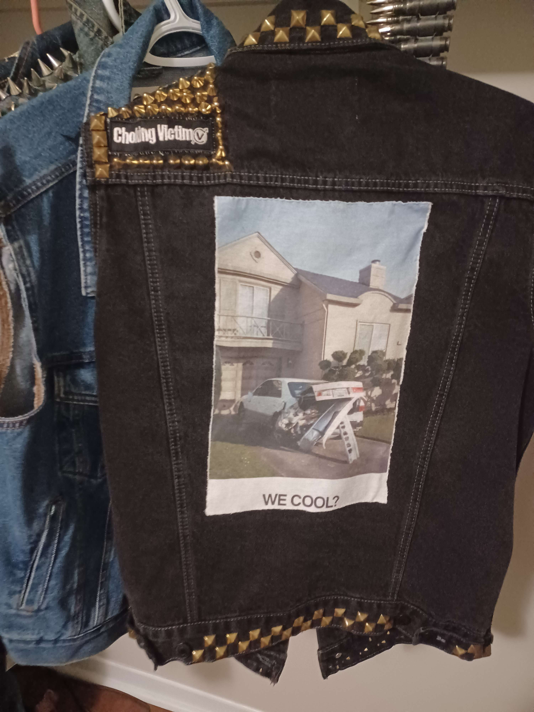
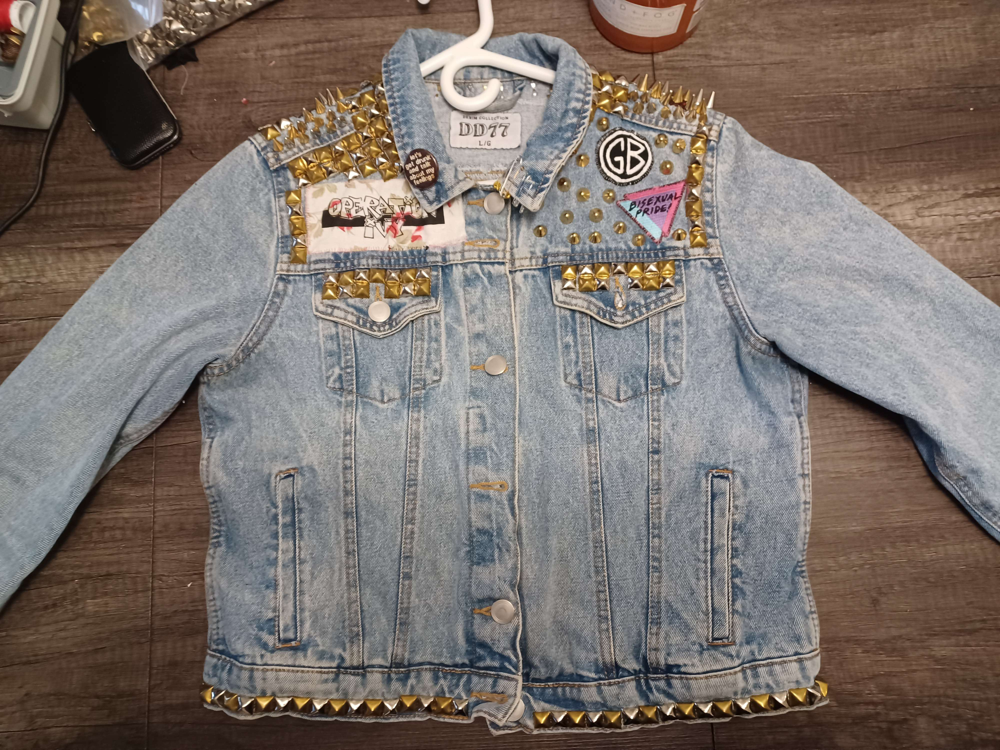
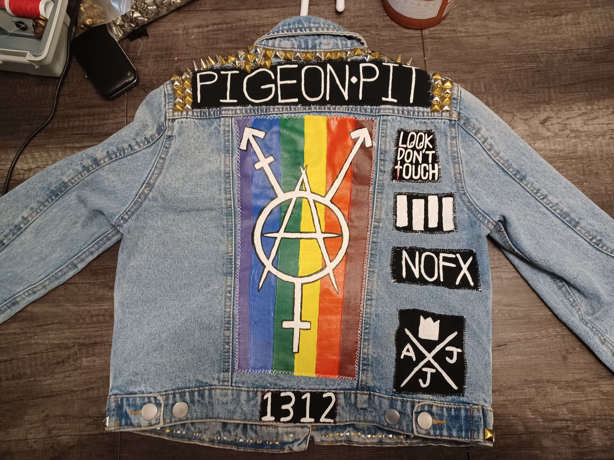

<html lang="en">
<head>
<meta charset="UTF-8">
<title>The A Team</title>
</head>
<body>

<header>
<h1 style="font-size:50px; color:pink">THE A TEAM</h1>
<nav>
    <ul>
        <li><a href="index.html">Home</a></li>
    </ul>
</nav>
</header>

<!-- I learned to change the colour and size of text here: https://www.w3schools.com/tags/tag_font.asp -->

<main>

 Welcome to Ramona and Kayla's Repository!

<section>

<h2 style="font-size:50px; color:pink">Team Member 1: Ramona Lozon
</h2>

My name is ramona! i was born in london but grew up in the country. I love all sorts of things but I'm a huge nerd 🤓 I'm into d&d, Warhammer, video games, history, sci fi/fantasy/horror, punk rock, stoner metal, synthwave and all kinds of music. I love modifying clothing and wearing a lot of spikes and studs.

<!-- i learned how to resize images here: https://www.w3schools.com/css/tryit.asp?filename=trycss_dim_height_percent -->

</section>

</main>
<footer>

&copy; copyright by ME bitch

<nav>
    <ul>
        <li><a href="index.html">Home</a></li>
    </ul> 
</nav>
</footer>
</body>